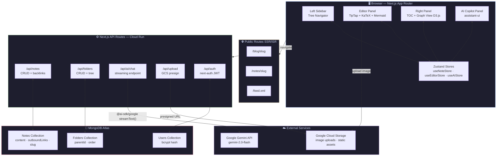
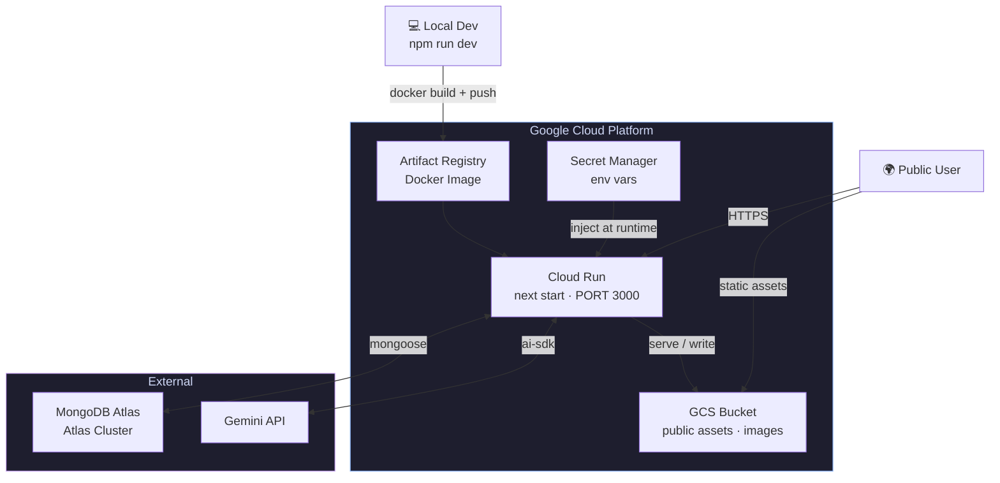

# Synapse — Architecture

> **📐 Developer Quick-Reference.** This file is a concise technical reference for daily development.
> For the formal architecture document — including architectural views, ADRs, quality attribute scenarios,
> and cross-cutting concerns — see [SAD.md](./SAD.md).

---

## 1. High-Level System Diagram



---

## 2. Project Folder Structure

```
note-app/
├── app/                          # Next.js App Router
│   ├── (auth)/
│   │   └── login/page.tsx
│   ├── (app)/                    # Protected routes
│   │   ├── layout.tsx            # Shell: sidebar + right panel
│   │   ├── page.tsx              # Dashboard / recent notes
│   │   └── notes/
│   │       └── [id]/page.tsx     # Editor page
│   ├── (public)/                 # Public-facing
│   │   ├── blog/[slug]/page.tsx
│   │   └── notes/[slug]/page.tsx
│   └── api/
│       ├── auth/[...nextauth]/route.ts
│       ├── notes/
│       │   ├── route.ts          # GET list, POST create
│       │   └── [id]/route.ts     # GET, PATCH, DELETE
│       ├── ai/
│       │   └── chat/route.ts     # Vercel AI SDK streaming endpoint
│       └── upload/route.ts       # GCS signed URL or direct upload
│
├── components/
│   ├── layout/
│   │   ├── Sidebar.tsx           # Tree file navigator
│   │   ├── RightPanel.tsx        # TOC + GraphView wrapper
│   │   └── AICopilotPanel.tsx    # Slide-over chat
│   ├── editor/
│   │   ├── Editor.tsx            # TipTap root
│   │   ├── extensions/           # Custom TipTap extensions
│   │   │   ├── WikiLink.ts
│   │   │   ├── KaTexExtension.ts
│   │   │   └── MermaidBlock.ts
│   │   └── toolbar/
│   │       └── Toolbar.tsx
│   ├── graph/
│   │   └── GraphView.tsx         # D3 force-directed graph
│   ├── toc/
│   │   └── TableOfContents.tsx
│   └── ui/                       # shadcn/ui re-exports
│
├── lib/
│   ├── db/
│   │   ├── mongoose.ts           # Connection singleton
│   │   └── models/
│   │       ├── Note.ts
│   │       ├── Folder.ts
│   │       └── User.ts
│   ├── ai/
│   │   └── gemini.ts             # Vercel AI SDK + Gemini config
│   ├── auth.ts                   # next-auth config
│   ├── gcs.ts                    # GCS client helpers
│   └── utils.ts
│
├── store/
│   ├── useNoteStore.ts           # Zustand: note tree, active note
│   ├── useEditorStore.ts         # Zustand: editor state
│   └── useAIStore.ts             # Zustand: AI panel open state, messages
│
├── hooks/
│   ├── useNotes.ts               # SWR/fetch helpers
│   └── useGraph.ts               # Graph data derivation
│
├── types/
│   └── index.ts                  # Shared TS types
│
├── public/
├── styles/
│   └── globals.css
├── .env.local                    # Secrets (not committed)
├── next.config.ts
├── tailwind.config.ts
└── tsconfig.json
```

---

## 3. MongoDB Data Models

### 3.1 Note

```typescript
interface INote {
  _id: ObjectId;
  userId: ObjectId; // owner — indexed
  title: string;
  slug: string; // last path segment, unique within folder
  pathSegments: string[]; // e.g. ['compiler', 'example'] — full materialized path
  content: string; // Raw TipTap JSON
  contentText: string; // plain-text for search
  type: "note" | "blog";
  visibility: "private" | "public"; // per-note access control
  folderId: ObjectId | null;
  tags: string[];
  outboundLinks: string[]; // slugs linked via [[wiki-link]]
  createdAt: Date;
  updatedAt: Date;
  publishedAt: Date | null;
}
```

> **Compound index:** `{ userId, pathSegments }` — ensures unique paths per user and fast lookups.

### 3.2 Folder

```typescript
interface IFolder {
  _id: ObjectId;
  userId: ObjectId; // owner — indexed
  name: string;
  slug: string; // URL-safe name segment
  parentId: ObjectId | null;
  pathSegments: string[]; // e.g. ['compiler'] for a root-level folder
  visibility: "private" | "public"; // sets default for new notes inside
  order: number;
  createdAt: Date;
  updatedAt: Date;
}
```

### 3.3 User

```typescript
interface IUser {
  _id: ObjectId;
  email: string;
  passwordHash: string; // bcrypt
  username: string; // unique, used in /u/[username]
  name: string;
  avatarUrl: string;
  bio: string;
  role: "user" | "admin";
  emailVerified: boolean;
  createdAt: Date;
}
```

### Backlink Index

Backlinks are **derived at query time** using a reverse lookup on `outboundLinks`:

```
db.notes.find({ outboundLinks: { $in: [targetSlug] } })
```

This avoids a separate backlinks collection and keeps writes simple.

---

## 4. API Routes

### Notes

| Method | Endpoint                          | Auth      | Description                                                   |
| ------ | --------------------------------- | --------- | ------------------------------------------------------------- |
| GET    | `/api/notes`                      | ✅        | List own note tree                                            |
| POST   | `/api/notes`                      | ✅        | Create note                                                   |
| GET    | `/api/notes/[id]`                 | ✅        | Get single note                                               |
| PATCH  | `/api/notes/[id]`                 | ✅        | Update content / metadata                                     |
| DELETE | `/api/notes/[id]`                 | ✅        | Delete note                                                   |
| GET    | `/api/notes/[id]/backlinks`       | ✅        | Get backlinks                                                 |
| PATCH  | `/api/notes/[id]/visibility`      | ✅        | Toggle public / private                                       |
| GET    | `/api/share/[username]/[...path]` | ❌ public | Resolve pretty URL → note data (only if `visibility: public`) |

### Folders

| Method | Endpoint            | Auth | Description         |
| ------ | ------------------- | ---- | ------------------- |
| GET    | `/api/folders`      | ✅   | List folders (tree) |
| POST   | `/api/folders`      | ✅   | Create folder       |
| PATCH  | `/api/folders/[id]` | ✅   | Rename / move       |
| DELETE | `/api/folders/[id]` | ✅   | Delete folder       |

### AI

| Method | Endpoint       | Auth | Description                |
| ------ | -------------- | ---- | -------------------------- |
| POST   | `/api/ai/chat` | ✅   | Streaming chat with Gemini |

### Upload

| Method | Endpoint      | Auth | Description                     |
| ------ | ------------- | ---- | ------------------------------- |
| POST   | `/api/upload` | ✅   | Get GCS presigned URL for image |

### Auth

| Method | Endpoint      | Auth | Description        |
| ------ | ------------- | ---- | ------------------ |
| POST   | `/api/auth/*` | —    | next-auth handlers |

---

## 5. Next.js Routing

```
# Auth
/login                              → Login
/register                           → Sign-up

# Private app
/app                                → Dashboard (protected)
/app/notes/[id]                     → Editor (protected)
/app/settings                       → Account settings

# Public user-facing (pretty URLs)
/[username]                         → User profile + public notes
/[username]/[...path]               → Public note at that path e.g.
                                      /rakin/compiler/example
                                      /rakin/blog/my-first-post

# Global
/blog                               → Global published blog listing
/feed.xml                           → RSS
/admin                              → Admin panel (role: admin)
```

> **Catch-all route:** `app/[username]/[...path]/page.tsx` handles any depth.
> The server resolver looks up `{ username } → userId` then `{ userId, pathSegments }` → note.
> Returns **404 for private notes** — no info leakage.

---

## 6. Zustand Store Slices

### `useNoteStore`

```typescript
{
  tree: FolderNode[];          // full sidebar tree
  activeNoteId: string | null;
  setActiveNote: (id) => void;
  refreshTree: () => Promise<void>;
}
```

### `useEditorStore`

```typescript
{
  note: INote | null;
  isSaving: boolean;
  lastSaved: Date | null;
  setNote: (note) => void;
  save: () => Promise<void>;   // debounced auto-save
}
```

### `useAIStore`

```typescript
{
  isOpen: boolean;
  toggle: () => void;
  messages: Message[];
  isStreaming: boolean;
}
```

---

## 7. Component Hierarchy

```
RootLayout
└── (app) layout
    ├── Sidebar                     ← Zustand: useNoteStore
    │   ├── SearchBar
    │   ├── FolderTree (recursive)
    │   │   ├── FolderNode
    │   │   └── NoteNode
    │   └── NewNote / NewFolder buttons
    ├── main
    │   └── Editor (TipTap)         ← Zustand: useEditorStore
    │       ├── Toolbar
    │       ├── EditorContent
    │       └── WikiLink popover
    ├── RightPanel
    │   ├── TableOfContents         ← derives from editor headings
    │   └── GraphView (D3)          ← derives from note outboundLinks
    └── AICopilotPanel (slide-over) ← Zustand: useAIStore
        └── assistant-ui Thread
```

---

## 8. Graph View Design

- **Data source:** `/api/notes` returns all notes with `outboundLinks`. A flat array of `{id, slug, title, links[]}` is passed to the graph component.
- **Render:** D3.js `forceSimulation` with `forceLink`, `forceManyBody`, `forceCenter`.
- **Interaction:** Click node → navigate to that note. Hover → show tooltip. Current active note is highlighted.
- **Scoping:** Graph in editor right panel shows only notes **within 2 hops** of the current note. Full graph is optional in a dedicated `/graph` page.

---

## 9. AI Copilot Integration

See `AI_ASSISTANT.md` for the full comparison.  
**Decision: Vercel AI SDK + `assistant-ui`**

```
User types → assistant-ui Thread component
           → POST /api/ai/chat (fetch stream)
           → Vercel AI SDK streamText()
           → Gemini Flash API (with note context in system prompt)
           → Server-Sent Events streamed back
           → assistant-ui renders tokens as they arrive
```

System prompt template:

```
You are a writing assistant helping with a note titled "{{title}}".
Current note content:
---
{{contentText}}
---
Help the user with their writing. Be concise.
```

---

## 10. Deployment Topology (GCS + Cloud Run)



**Deployment steps (overview):**

1. `docker build` → push image to **Google Artifact Registry**
2. `gcloud run deploy Synapse --image ...`
3. Static assets served from GCS Bucket (public) or directly from Cloud Run
4. Environment variables injected via **Cloud Run secrets** (linked to Secret Manager)

---

## 11. Pretty URL System

### How it works

```
Synapse.app/rakin/compiler/example
             ↑       ↑         ↑
          username  folder    note slug
```

**Resolution flow (server-side in `app/[username]/[...path]/page.tsx`):**

```
1. Look up User by username → get userId
2. Reconstruct pathSegments from [...path] param
3. Query: Note.findOne({ userId, pathSegments, visibility: 'public' })
4. If found → render note
5. If not found OR visibility === 'private' → return 404 (identical response)
```

> The key security detail: private and non-existent notes return **the same 404** — a visitor cannot tell if a private note exists at a path.

### Folder share rules

| Folder visibility | Child note default | Child note can override? |
| ----------------- | ------------------ | ------------------------ |
| `private`         | `private`          | ✅ yes, per note         |
| `public`          | `public`           | ✅ yes, can set private  |

### Share UI (in editor top bar)

- **Share icon** → opens a modal
- Toggle: **Private / Public**
- When public: shows copyable pretty URL (`Synapse.app/rakin/compiler/example`)
- Optional: **copy Markdown embed link**, **copy iframe embed**

---

## 12. Security Model

### Potential vulnerabilities & mitigations

| Risk                                    | How it could happen                                   | Mitigation                                                                                                      |
| --------------------------------------- | ----------------------------------------------------- | --------------------------------------------------------------------------------------------------------------- |
| **Private note enumeration**            | Attacker guesses `Synapse.app/rakin/secret-plans`    | Server always returns identical 404 for both "not found" and "private" — no distinguishable response            |
| **Path traversal**                      | `[...path]` includes `../` or encoded slashes         | Next.js automatically decodes and normalises path params; DB query uses array equality, not string `LIKE`       |
| **Username squatting of system routes** | User registers username `app`, `api`, `admin`, `blog` | Blocklist reserved usernames at sign-up: `['app', 'api', 'admin', 'blog', 'login', 'register', 'feed']`         |
| **Content scraping / rate abuse**       | Bot hammers public note pages                         | Rate limiting middleware on `/[username]/*` routes (e.g. `next-rate-limit` or Cloudflare in front of Cloud Run) |
| **XSS via Markdown**                    | User publishes note with `<script>` in content        | TipTap serialises to JSON internally; public renderer uses `rehype-sanitize` before rendering HTML              |
| **IDOR on private API**                 | Authenticated user fetches another user's note by ID  | Every `/api/notes/[id]` handler checks `note.userId === session.user.id` before returning data                  |
| **Slug collision across users**         | Two users both have `/rakin/example`                  | Compound index `{ userId, pathSegments }` in MongoDB enforces uniqueness per user, not globally                 |
| **OAuth account hijack**                | Attacker creates GitHub account with victim's email   | next-auth links OAuth accounts by verified email only; unverified emails are blocked                            |

### Username validation rules

```
- 3–32 characters
- Alphanumeric + hyphens only: /^[a-z0-9-]+$/
- Cannot start or end with a hyphen
- Blocklist: app, api, admin, blog, login, register, feed, settings, u, about
```
