# Synapse — Software Architecture Document (SAD)

> **Document type:** Software Architecture Document (SAD) — IEEE 1471 / arc42 hybrid  
> **Project:** Synapse — Production-ready, Notion-inspired knowledge management & blogging platform  
> **Version:** 1.0  
> **Date:** 2026-03-05  
> **Status:** Draft  
> **Related docs:** [SRS.md](./SRS.md) · [SRD.md](./SRD.md) · [ARCHITECTURE.md](./ARCHITECTURE.md) _(developer quick-reference)_

---

## Table of Contents

1. [Introduction](#1-introduction)
2. [Architectural Goals & Constraints](#2-architectural-goals--constraints)
3. [System Context View](#3-system-context-view)
4. [Logical View — Component Decomposition](#4-logical-view--component-decomposition)
5. [Process View — Runtime Behaviour](#5-process-view--runtime-behaviour)
6. [Development View — Module Structure](#6-development-view--module-structure)
7. [Deployment View — Physical Infrastructure](#7-deployment-view--physical-infrastructure)
8. [Data Architecture](#8-data-architecture)
9. [Security Architecture](#9-security-architecture)
10. [Cross-Cutting Concerns](#10-cross-cutting-concerns)
11. [Architecture Decision Records (ADRs)](#11-architecture-decision-records-adrs)
12. [Quality Attribute Scenarios](#12-quality-attribute-scenarios)
13. [Architecture Risks & Technical Debt](#13-architecture-risks--technical-debt)

---

## 1. Introduction

### 1.1 Purpose

This Software Architecture Document (SAD) describes the **architectural structure** of Synapse — the significant decisions, components, views, and rationale that govern how the system is built, deployed, and evolved. It is intended for:

- **Developers** implementing or extending the system.
- **Architects / Tech leads** reviewing design consistency.
- **Stakeholders** needing to understand technical risk and quality trade-offs.

This document is **prescriptive for v1** (MVP through Phase 4). It will be updated as the system evolves.

### 1.2 Scope

Synapse is a full-stack web application with:

- A **Next.js 14 App Router** frontend and API layer.
- A **MongoDB Atlas** document database.
- **Google Cloud Storage (GCS)** for binary assets.
- **Google Gemini API** for AI-powered text generation.
- Deployment on **Google Cloud Run** via Docker.

### 1.3 Architectural Approach

Synapse follows a **modular monolith** architecture packaged as a single Next.js application. A deliberate micro-services split is deferred until traffic demands warrant it. Key principles:

| Principle                   | Application in Synapse                                                          |
| --------------------------- | -------------------------------------------------------------------------------- |
| **Separation of concerns**  | API routes, data models, UI components, and stores in distinct directories       |
| **Ownership boundaries**    | Every data document carries `userId`; no cross-user data access in API           |
| **Stateless server**        | No in-process session state; JWT managed by next-auth; files in GCS              |
| **Progressive enhancement** | Server-side rendering for public pages; client-side hydration for the editor app |
| **Encapsulate externals**   | All third-party clients (DB, GCS, Gemini) isolated in `lib/` modules             |

### 1.4 Definitions

| Term    | Meaning                                                                                           |
| ------- | ------------------------------------------------------------------------------------------------- |
| **RSC** | React Server Component — renders on the server, zero JS sent to client                            |
| **RCC** | React Client Component — hydrated and interactive in the browser                                  |
| **ADR** | Architecture Decision Record — a permanent log of a significant design choice                     |
| **QAS** | Quality Attribute Scenario — a stimulus/response pair used to reason about non-functional quality |
| **ODM** | Object Document Mapper (Mongoose)                                                                 |
| **SSE** | Server-Sent Events — the streaming protocol used for AI token delivery                            |
| **ISR** | Incremental Static Regeneration                                                                   |
| **JWT** | JSON Web Token — the session token format used by next-auth                                       |

---

## 2. Architectural Goals & Constraints

### 2.1 Driving Quality Attributes

The following quality attributes are ranked in order of architectural importance for Synapse v1:

| Rank | Quality Attribute | Rationale                                                                       |
| ---- | ----------------- | ------------------------------------------------------------------------------- |
| 1    | **Security**      | Multi-user platform; private notes must never leak to other users or the public |
| 2    | **Usability**     | Editor must feel fast and responsive; auto-save must be invisible               |
| 3    | **Performance**   | Public SSR pages must pass Core Web Vitals; editor must be lag-free             |
| 4    | **Modifiability** | Codebase grows across 5 phases; new features must slot in without rewrites      |
| 5    | **Availability**  | 99.5% monthly SLO; unexpected downtime erodes user trust                        |
| 6    | **Scalability**   | Must scale horizontally when Cloud Run auto-scales under load                   |

### 2.2 Architectural Constraints

| ID    | Constraint                                                                               | Source    |
| ----- | ---------------------------------------------------------------------------------------- | --------- |
| AC-01 | Must run as a Docker container on Google Cloud Run                                       | Business  |
| AC-02 | Data store is MongoDB Atlas; no relational DB                                            | Business  |
| AC-03 | Next.js 14 App Router only; Pages Router disallowed                                      | Technical |
| AC-04 | TypeScript strict mode throughout                                                        | Technical |
| AC-05 | shadcn/ui + Tailwind CSS required (editor UI coherence)                                  | Technical |
| AC-06 | All secrets injected at runtime via Cloud Secret Manager; no hardcoded credentials       | Security  |
| AC-07 | TipTap (ProseMirror) is the mandated editor; alternative editors are out of scope for v1 | Product   |
| AC-08 | Google Gemini is the sole AI provider for v1                                             | Product   |

---

## 3. System Context View

The context view shows Synapse as a black box and its external actors and systems.

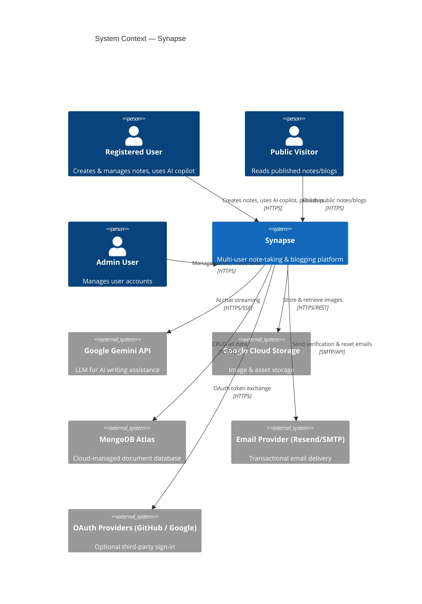

### 3.1 External System Responsibilities

| External System      | Synapse's Dependency                | Failure Impact                                          |
| -------------------- | ------------------------------------ | ------------------------------------------------------- |
| MongoDB Atlas        | All persistent data storage          | Critical — full platform outage                         |
| Google Gemini API    | AI Copilot responses                 | Moderate — AI panel unavailable; rest of app unaffected |
| Google Cloud Storage | Image uploads and serving            | Moderate — images unavailable; editor still usable      |
| Email Provider       | Account verification, password reset | Low — new registrations and resets fail                 |
| OAuth Providers      | Optional sign-in method              | Low — credential login still works                      |

---

## 4. Logical View — Component Decomposition

The logical view describes the **major software components** and their responsibilities.

### 4.1 Component Diagram

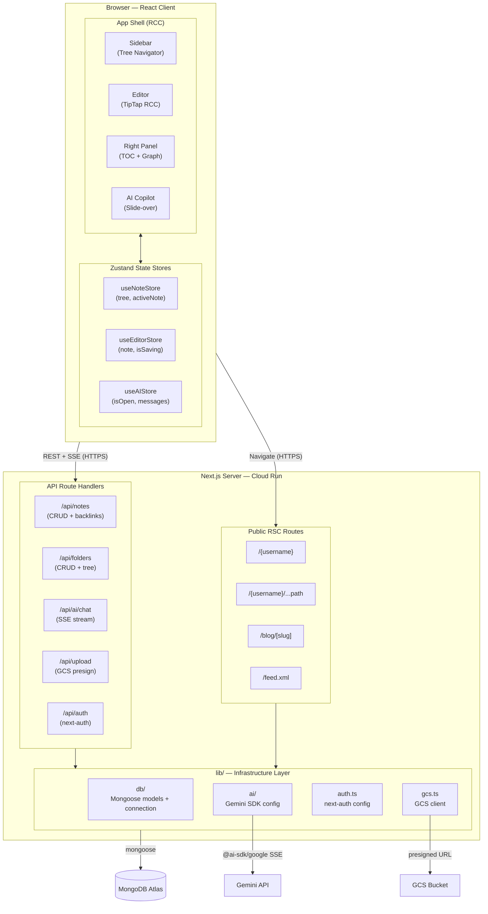

### 4.2 Component Responsibilities

#### 4.2.1 Browser — App Shell

| Component        | Type | Responsibility                                                                        |
| ---------------- | ---- | ------------------------------------------------------------------------------------- |
| `Sidebar`        | RCC  | Renders the collapsible folder/note tree; handles create/rename/delete/search         |
| `Editor`         | RCC  | TipTap ProseMirror instance; extensions for wiki-link, KaTeX, Mermaid; debounced save |
| `RightPanel`     | RCC  | Hosts `TableOfContents` and `GraphView`; toggled by user                              |
| `AICopilotPanel` | RCC  | Slide-over chat panel using `assistant-ui`; streams via Vercel AI SDK `useChat`       |

#### 4.2.2 Browser — Zustand Stores

| Store            | State Managed                                         | Subscribers            |
| ---------------- | ----------------------------------------------------- | ---------------------- |
| `useNoteStore`   | `tree: FolderNode[]`, `activeNoteId`, `refreshTree()` | Sidebar, Editor        |
| `useEditorStore` | `note: INote`, `isSaving`, `lastSaved`, `save()`      | Editor, top bar        |
| `useAIStore`     | `isOpen`, `messages`, `isStreaming`, `toggle()`       | AICopilotPanel, button |

#### 4.2.3 Server — Public RSC Routes

| Route                 | Render Strategy | Responsibility                                       |
| --------------------- | --------------- | ---------------------------------------------------- |
| `/{username}`         | SSR             | Render public user profile + list of public notes    |
| `/{username}/...path` | SSR             | Resolve path to note; return 404 for private/missing |
| `/blog/[slug]`        | ISR (60 s)      | Global blog listing / single blog post               |
| `/feed.xml`           | SSR             | RSS feed for all public blog posts                   |

#### 4.2.4 Server — API Routes

| Route                              | Auth | Responsibility                                                       |
| ---------------------------------- | ---- | -------------------------------------------------------------------- |
| `GET /api/notes`                   | ✅   | Return the full note tree for the session user                       |
| `POST /api/notes`                  | ✅   | Create a new note; set `userId`, `pathSegments`, defaults            |
| `GET /api/notes/[id]`              | ✅   | Return single note if `note.userId === session.userId`               |
| `PATCH /api/notes/[id]`            | ✅   | Update content, title, tags, visibility — ownership checked          |
| `DELETE /api/notes/[id]`           | ✅   | Delete note — ownership checked                                      |
| `GET /api/notes/[id]/backlinks`    | ✅   | Query `{ outboundLinks: { $in: [slug] } }` and return matching notes |
| `PATCH /api/notes/[id]/visibility` | ✅   | Toggle `private` ↔ `public`                                          |
| `GET /api/folders`                 | ✅   | Return folder tree for session user                                  |
| `POST /api/folders`                | ✅   | Create folder                                                        |
| `PATCH /api/folders/[id]`          | ✅   | Rename / move folder — ownership checked                             |
| `DELETE /api/folders/[id]`         | ✅   | Delete folder + cascade children — ownership checked                 |
| `POST /api/ai/chat`                | ✅   | Accept messages + noteContext; stream Gemini response via SSE        |
| `POST /api/upload`                 | ✅   | Generate GCS presigned PUT URL scoped to `uploads/{userId}/`         |
| `/api/auth/[...nextauth]`          | —    | next-auth handlers: login, logout, session, callback                 |

#### 4.2.5 Server — Infrastructure Library (`lib/`)

| Module           | Responsibility                                                                                 |
| ---------------- | ---------------------------------------------------------------------------------------------- |
| `db/mongoose.ts` | Mongoose connection singleton; prevents multiple connections in Next.js hot-reload / Cloud Run |
| `db/models/`     | Mongoose schemas: `Note`, `Folder`, `User` with indexes and validation                         |
| `ai/gemini.ts`   | Configures `@ai-sdk/google` provider; exports model reference used by chat route               |
| `auth.ts`        | next-auth v5 configuration: credentials provider, JWT callbacks, session shape                 |
| `gcs.ts`         | GCS `Storage` client; `generatePresignedUrl()` helper                                          |
| `utils.ts`       | Slug generation, path-segment helpers, date formatters                                         |

---

## 5. Process View — Runtime Behaviour

The process view documents the **key runtime flows** through the system.

### 5.1 Note Auto-Save Flow

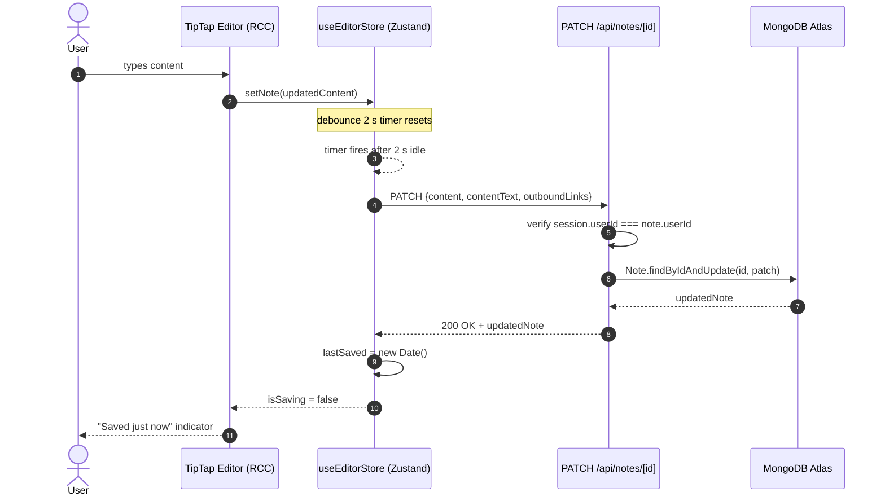

### 5.2 Public Note Resolution Flow

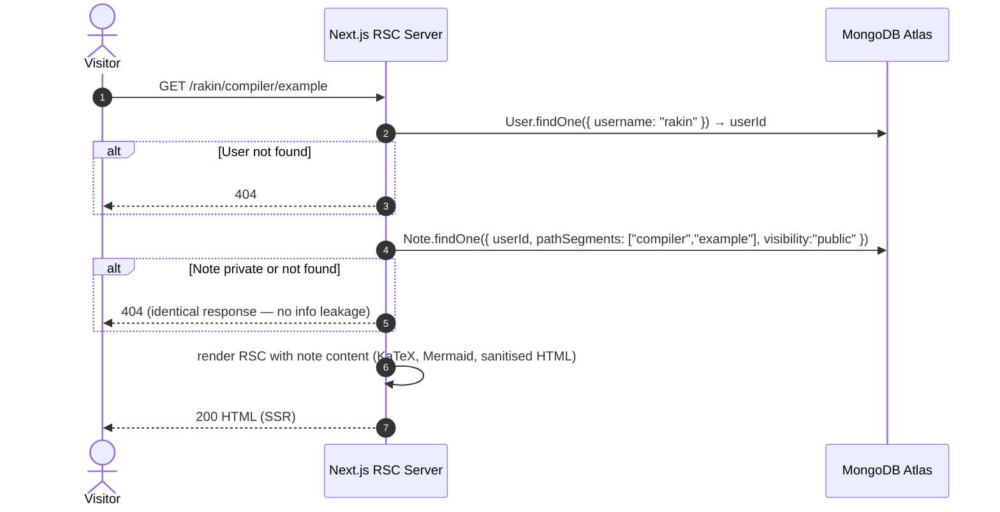

### 5.3 AI Copilot Streaming Flow

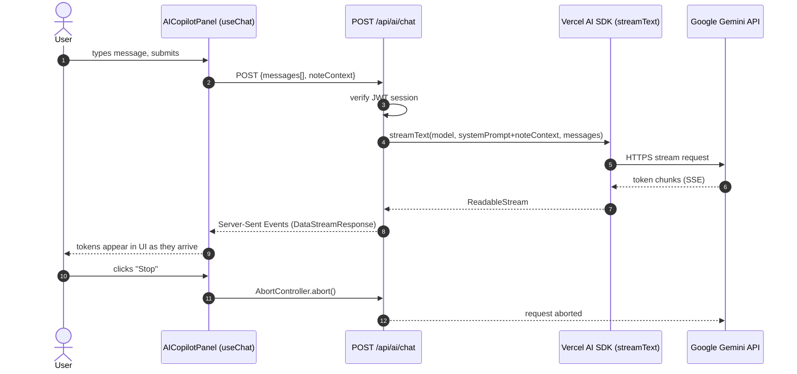

### 5.4 Image Upload Flow

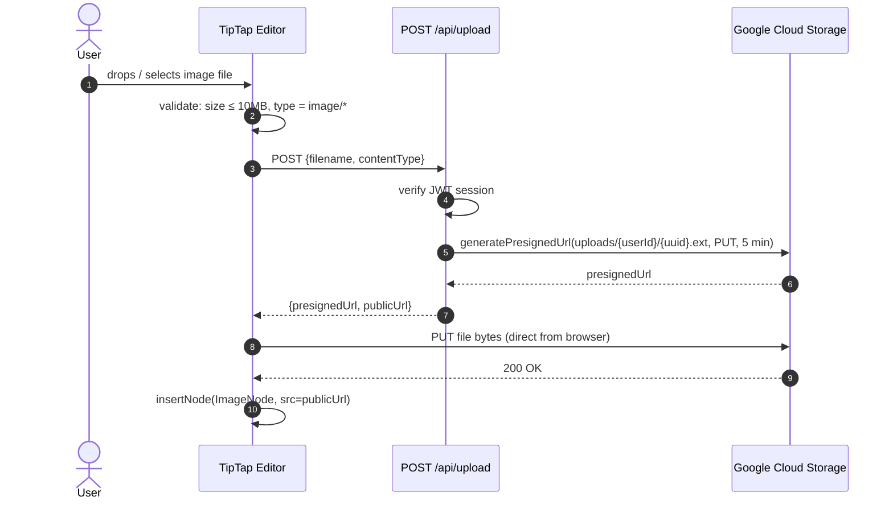

### 5.5 Authentication Flow (Credentials)

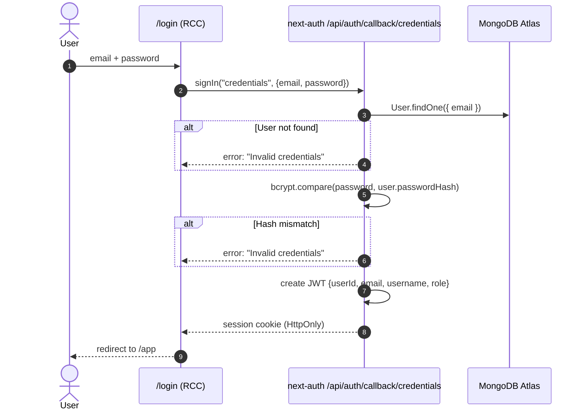

---

## 6. Development View — Module Structure

The development view describes how the **codebase is organised** into modules and the rules governing dependencies between them.

### 6.1 Directory Structure and Layer Map

```
note-app/
│
├── app/                        ← [ROUTING LAYER] Next.js App Router
│   ├── (auth)/                 ← Public auth pages (login, register)
│   ├── (app)/                  ← Protected app shell (layout + editor)
│   ├── (public)/               ← SSR public blog/notes pages
│   └── api/                    ← API Route Handlers
│       ├── auth/
│       ├── notes/
│       ├── folders/
│       ├── ai/
│       └── upload/
│
├── components/                 ← [UI LAYER] Pure React components
│   ├── layout/                 ← App shell: Sidebar, RightPanel, AICopilotPanel
│   ├── editor/                 ← TipTap + extensions + Toolbar
│   ├── graph/                  ← D3 GraphView
│   ├── toc/                    ← TableOfContents
│   └── ui/                     ← shadcn/ui re-exports
│
├── store/                      ← [STATE LAYER] Zustand stores
│   ├── useNoteStore.ts
│   ├── useEditorStore.ts
│   └── useAIStore.ts
│
├── hooks/                      ← [CUSTOM HOOKS] Data-fetching hooks
│   ├── useNotes.ts
│   └── useGraph.ts
│
├── lib/                        ← [INFRASTRUCTURE LAYER] All external integrations
│   ├── db/
│   │   ├── mongoose.ts         ← Connection singleton
│   │   └── models/             ← Mongoose schemas
│   ├── ai/
│   │   └── gemini.ts           ← AI SDK config
│   ├── auth.ts                 ← next-auth config
│   ├── gcs.ts                  ← GCS client
│   └── utils.ts
│
├── types/                      ← [TYPES LAYER] Shared TypeScript interfaces
│   └── index.ts
│
└── public/ / styles/           ← Static assets and global CSS
```

### 6.2 Layer Dependency Rules

The following directed dependency rules must be respected. Violations are architectural debt:

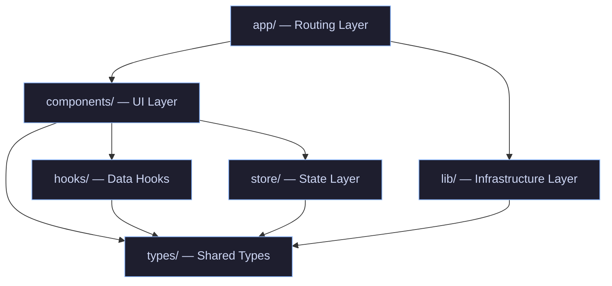

**Rules:**

- `components/` must **never** import directly from `app/api/*`.
- `lib/` must **never** import from `components/` or `store/`.
- `store/` must **never** import from `lib/` directly — it calls API routes via `fetch`.
- `types/index.ts` is the **only shared boundary** — all layers may import from it.
- Server-only modules (`lib/db/`, `lib/gcs.ts`, `lib/auth.ts`) must use the `server-only` package to prevent accidental client-side bundling.

### 6.3 Key TipTap Extensions

| Extension        | File                                  | Responsibility                                             |
| ---------------- | ------------------------------------- | ---------------------------------------------------------- |
| `WikiLink`       | `editor/extensions/WikiLink.ts`       | Parse `[[slug]]` marks; render highlighted span with click |
| `KaTeXExtension` | `editor/extensions/KaTexExtension.ts` | Detect `$…$` and `$$…$$` nodes; render via KaTeX           |
| `MermaidBlock`   | `editor/extensions/MermaidBlock.ts`   | Detect ` ```mermaid ` fence; render Mermaid SVG            |
| `ShikiHighlight` | `editor/extensions/ShikiHighlight.ts` | Syntax-highlight code blocks via Shiki                     |

---

## 7. Deployment View — Physical Infrastructure

### 7.1 Infrastructure Topology

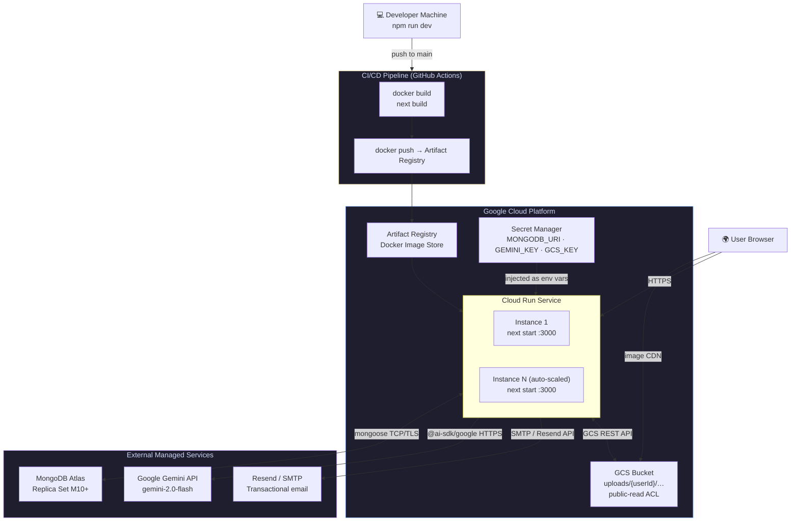

### 7.2 Cloud Run Configuration

| Setting                   | Value              | Rationale                                                   |
| ------------------------- | ------------------ | ----------------------------------------------------------- |
| **Min instances**         | 1                  | Eliminates cold-start latency for first request             |
| **Max instances**         | 10                 | Cost cap; re-evaluate at scale                              |
| **Memory**                | 512 MB             | Next.js server + Mongoose connection pool                   |
| **CPU**                   | 1 vCPU             | Adequate for SSR; AI streaming is I/O-bound                 |
| **Concurrency**           | 80 req / instance  | Cloud Run default; Node.js handles concurrency well         |
| **Port**                  | 3000               | `next start` default                                        |
| **Timeout**               | 60 s               | AI streaming may hold connections open                      |
| **Environment variables** | Via Secret Manager | `MONGODB_URI`, `GEMINI_API_KEY`, `NEXTAUTH_SECRET`, `GCS_*` |

### 7.3 GCS Bucket Configuration

| Setting         | Value                                               |
| --------------- | --------------------------------------------------- |
| **Bucket name** | `Synapse-uploads`                                  |
| **Object path** | `uploads/{userId}/{uuid}.{ext}`                     |
| **ACL**         | Public-read on objects (images served directly)     |
| **CORS**        | Allow PUT from `Synapse.app` origin only           |
| **Lifecycle**   | Soft-delete orphaned objects after 90 days (future) |

### 7.4 MongoDB Atlas Configuration

| Setting             | Value                                     |
| ------------------- | ----------------------------------------- |
| **Cluster tier**    | M10 (or higher for production)            |
| **Replica set**     | 3-node replica set (Atlas default)        |
| **Connection pool** | `maxPoolSize: 10` in Mongoose URI options |
| **Indexes**         | See [Section 8.3](#83-indexes)            |
| **Backups**         | Atlas automated backups (daily snapshot)  |

---

## 8. Data Architecture

### 8.1 Data Model Overview

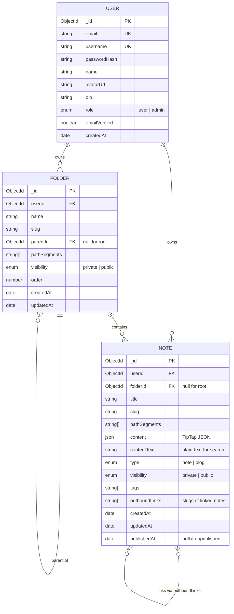

### 8.2 Document Schemas

#### User

```typescript
const UserSchema = new Schema<IUser>({
  email: { type: String, required: true, unique: true, lowercase: true },
  username: {
    type: String,
    required: true,
    unique: true,
    lowercase: true,
    match: /^[a-z0-9-]{3,32}$/,
  },
  passwordHash: { type: String, required: true },
  name: { type: String, default: "" },
  avatarUrl: { type: String, default: "" },
  bio: { type: String, default: "" },
  role: { type: String, enum: ["user", "admin"], default: "user" },
  emailVerified: { type: Boolean, default: false },
  createdAt: { type: Date, default: Date.now },
});
```

#### Folder

```typescript
const FolderSchema = new Schema<IFolder>(
  {
    userId: { type: ObjectId, ref: "User", required: true, index: true },
    name: { type: String, required: true },
    slug: { type: String, required: true },
    parentId: { type: ObjectId, ref: "Folder", default: null },
    pathSegments: { type: [String], required: true },
    visibility: {
      type: String,
      enum: ["private", "public"],
      default: "private",
    },
    order: { type: Number, default: 0 },
  },
  { timestamps: true },
);
```

#### Note

```typescript
const NoteSchema = new Schema<INote>(
  {
    userId: { type: ObjectId, ref: "User", required: true, index: true },
    folderId: { type: ObjectId, ref: "Folder", default: null },
    title: { type: String, required: true },
    slug: { type: String, required: true },
    pathSegments: { type: [String], required: true },
    content: { type: Schema.Types.Mixed, default: {} }, // TipTap JSON
    contentText: { type: String, default: "" },
    type: { type: String, enum: ["note", "blog"], default: "note" },
    visibility: {
      type: String,
      enum: ["private", "public"],
      default: "private",
    },
    tags: { type: [String], default: [] },
    outboundLinks: { type: [String], default: [] },
    publishedAt: { type: Date, default: null },
  },
  { timestamps: true },
);
```

### 8.3 Indexes

| Collection | Index Definition                              | Type            | Purpose                                             |
| ---------- | --------------------------------------------- | --------------- | --------------------------------------------------- |
| `users`    | `{ email: 1 }`                                | Unique          | Login lookup                                        |
| `users`    | `{ username: 1 }`                             | Unique          | Public URL username resolution                      |
| `notes`    | `{ userId: 1, pathSegments: 1 }`              | Unique compound | Enforce unique paths per user; fast path resolution |
| `notes`    | `{ userId: 1 }`                               | Regular         | List all notes for a user                           |
| `notes`    | `{ outboundLinks: 1 }`                        | Regular         | Backlink reverse lookup                             |
| `notes`    | `{ visibility: 1, type: 1, publishedAt: -1 }` | Regular         | Public blog listing, sorted by date                 |
| `folders`  | `{ userId: 1, pathSegments: 1 }`              | Unique compound | Enforce unique folder paths per user                |
| `folders`  | `{ userId: 1, parentId: 1 }`                  | Regular         | Tree traversal (children of a parent)               |

### 8.4 Data Flow: Backlink Index

Synapse uses a **derived backlink strategy** — no separate backlinks collection exists.

```
Write path:
  Editor saves note → extract [[slug]] tokens from content
                    → persist as note.outboundLinks[]

Read path (backlinks panel):
  GET /api/notes/[id]/backlinks
  → db.notes.find({ userId, outboundLinks: { $in: [currentNoteSlug] } })
  → return matching note titles + IDs
```

**Trade-off:** Simple write path at the cost of a potentially slower backlink query on very large collections. The `{ outboundLinks: 1 }` index keeps this O(log n). A dedicated backlinks collection would be introduced if query latency exceeds 50 ms at scale.

---

## 9. Security Architecture

### 9.1 Threat Model Summary

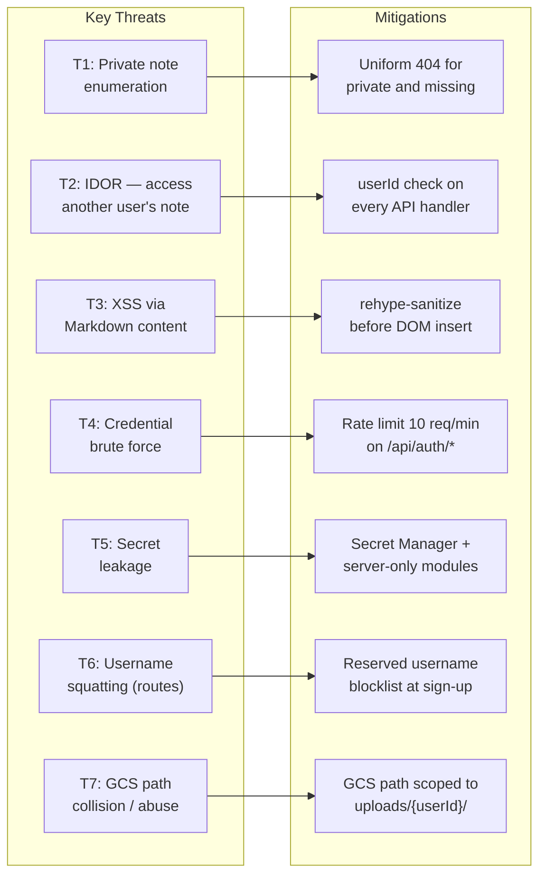

### 9.2 Authentication & Authorisation

| Layer           | Mechanism                                                                          |
| --------------- | ---------------------------------------------------------------------------------- |
| **Session**     | next-auth v5 JWT; `HttpOnly`, `Secure`, `SameSite=Lax` cookie attributes           |
| **Route guard** | Middleware checks session on all `/app/*` routes; redirects to `/login` if absent  |
| **API guard**   | Every API handler calls `getServerSession()` and returns 401 if missing            |
| **Ownership**   | Every mutating handler asserts `doc.userId.equals(session.user.id)` → 403 if false |
| **Role**        | Admin routes check `session.user.role === 'admin'`                                 |

### 9.3 Content Security

| Concern                 | Mitigation                                                                        |
| ----------------------- | --------------------------------------------------------------------------------- |
| **XSS in public pages** | `rehype-sanitize` with default schema strips script tags and event attributes     |
| **XSS in editor**       | TipTap stores content as JSON (not raw HTML); serialises to HTML only for display |
| **CSRF**                | next-auth includes CSRF token in form submissions by default                      |
| **Clickjacking**        | `X-Frame-Options: DENY` header set in `next.config.ts`                            |
| **Content sniffing**    | `X-Content-Type-Options: nosniff` header                                          |

### 9.4 Password Security

```
Registration:
  password (plain) → bcrypt.hash(password, 12) → stored as passwordHash

Login:
  password (plain) → bcrypt.compare(password, stored hash) → boolean result

Never stored / logged: plain-text password, partial hash
```

### 9.5 Secret Management

```
Development:  .env.local (git-ignored)
                └── MONGODB_URI
                └── GEMINI_API_KEY
                └── NEXTAUTH_SECRET
                └── GCS_PROJECT_ID / KEY_FILE

Production:   Google Cloud Secret Manager
                └── Secrets mounted as environment variables in Cloud Run
                └── IAM role: Cloud Run SA has secretmanager.secretAccessor
```

---

## 10. Cross-Cutting Concerns

### 10.1 Error Handling Strategy

| Layer                | Strategy                                                                                                                  |
| -------------------- | ------------------------------------------------------------------------------------------------------------------------- |
| **API routes**       | Try/catch in every handler; distinguish client errors (4xx) from server errors (5xx); log 5xx with stack trace            |
| **Editor auto-save** | Exponential backoff (1s, 2s, 4s, max 3 retries); display error toast on final failure; preserve content in `localStorage` |
| **AI streaming**     | Catch `AbortError` silently; surface other errors as a chat system message                                                |
| **Image upload**     | Validate locally before request; display toast on GCS error                                                               |
| **Public pages**     | `notFound()` for missing/private notes; `error.tsx` boundary for unexpected errors                                        |

### 10.2 Logging

| Environment | Approach                                                                                         |
| ----------- | ------------------------------------------------------------------------------------------------ |
| Development | `console.error` with stack traces; Next.js built-in dev overlay                                  |
| Production  | `console.error/warn` captured by Cloud Run structured logging (auto-ingested into Cloud Logging) |
| Future      | Integrate `pino` for structured JSON logs with request IDs; add Cloud Trace correlation IDs      |

**What is always logged:**

- All 5xx API responses (error + stack)
- Failed authentication attempts (email, timestamp — not password)
- All admin actions (userId, action, target)

**What is never logged:**

- Passwords (even hashed)
- JWT tokens or session cookies
- Full note content (PII risk)

### 10.3 Caching Strategy

| Resource                   | Cache Mechanism                                           | TTL / Invalidation                                                 |
| -------------------------- | --------------------------------------------------------- | ------------------------------------------------------------------ |
| Public blog/note SSR pages | Next.js ISR (revalidate: 60s)                             | On `visibility` change, manual revalidation via `revalidatePath()` |
| API note list              | No server cache; client-side SWR / Zustand                | Invalidated on create/update/delete                                |
| Graph data                 | Derived client-side from note list                        | Refreshed on note tree refresh                                     |
| GCS images                 | GCS default CDN caching (Cache-Control: max-age=31536000) | Immutable by design (UUID filenames)                               |

### 10.4 Internationalisation (i18n)

Synapse v1 is **English-only**. The codebase is structured to allow future i18n:

- All UI strings in component files (not extracted to message bundles yet).
- No RTL layout considerations in v1.
- Future: `next-intl` library for App Router.

### 10.5 Accessibility

- shadcn/ui components are built on Radix UI primitives, which are ARIA-compliant by default.
- Keyboard navigation: sidebar, editor toolbar, and modals must be fully keyboard-accessible.
- Colour contrast: all text must meet WCAG 2.1 Level AA (4.5:1 ratio minimum).
- Focus management: modal open/close must trap and restore focus correctly (Radix handles this).

### 10.6 Observability (Future Phase 5)

| Signal  | Tool                                                                      |
| ------- | ------------------------------------------------------------------------- |
| Metrics | Cloud Monitoring (Cloud Run built-in: request count, latency, error rate) |
| Traces  | Cloud Trace with `@opentelemetry/sdk-node`                                |
| Alerts  | Cloud Monitoring alert policies on 5xx rate > 1% and p99 latency > 2s     |

---

## 11. Architecture Decision Records (ADRs)

Each ADR documents a significant technical decision. Once accepted, ADRs are immutable — they are superseded by new ADRs, never overwritten.

---

### ADR-001: Next.js 14 App Router as the unified full-stack framework

**Date:** 2026-03-03  
**Status:** Accepted

**Context:**  
Synapse needs both server-side rendered public pages (for SEO) and a rich interactive client-side editor. A pure SPA (e.g., CRA/Vite) would require a separate server; a pure SSR framework would make the editor difficult. We evaluated: Next.js 14 (App Router), Remix, SvelteKit, and a separate React SPA + Express API.

**Decision:**  
Use **Next.js 14 App Router** as the sole framework. Public pages use RSC (server-rendered HTML). The protected `/app/*` routes are client-hydrated shells.

**Rationale:**

- Single deployable unit reduces operational complexity (one Docker image).
- App Router's RSC-first model gives the best SSR performance for public pages without a separate server.
- Native API routes eliminate the need for a separate Express server.
- First-class Vercel AI SDK integration simplifies the streaming AI endpoint.

**Consequences:**

- Developers must understand RSC vs. RCC rendering boundaries.
- `"use client"` must be added intentionally; client bundle bloat is a risk if RSC boundaries are not respected.

---

### ADR-002: MongoDB Atlas as the document database

**Date:** 2026-03-03  
**Status:** Accepted

**Context:**  
Notes have a tree structure (nested folders + notes) and variable-shape content (TipTap JSON that evolves as extensions are added). Relational databases require rigid schemas and complex joins for hierarchical data.

**Decision:**  
Use **MongoDB Atlas** with Mongoose ODM.

**Rationale:**

- Document model fits note content (JSON) naturally — no ORM translation needed.
- `pathSegments` array enables materialised path queries without recursive CTEs.
- Atlas provides managed backups, replica sets, and connection pooling out of the box.
- Flexible schema allows adding new note fields (e.g., `coverImage`, `summary`) without migrations.

**Consequences:**

- No ACID multi-document transactions for complex operations (folder cascade delete uses sequential operations, not a transaction in v1).
- Developers must manually enforce relational-like constraints (ownership checks in application code, not DB-level FK constraints).

---

### ADR-003: Vercel AI SDK + assistant-ui for the AI Copilot

**Date:** 2026-03-03  
**Status:** Accepted

**Context:**  
We evaluated four approaches for the AI integration: (A) Vercel AI SDK + `assistant-ui`, (B) custom `fetch` + `ReadableStream`, (C) LangChain.js, (D) OpenAI SDK pointed at Gemini's OpenAI-compatible endpoint.

**Decision:**  
Use **Vercel AI SDK (`ai`, `@ai-sdk/google`)** for the backend streaming route and **`assistant-ui`** for the chat panel UI.

**Rationale:**

- Vercel AI SDK natively supports Gemini via `@ai-sdk/google`; streaming, abort, and tool-calling are handled by the SDK.
- `assistant-ui` provides production-quality chat UI components (auto-scroll, abort button, Markdown rendering) that match shadcn/ui design system.
- Combined integration effort is ~3 hours vs. 8–15 hours for a custom implementation.
- Switching AI providers in future (e.g., OpenAI) requires changing only the model adapter, not the architecture.

**Consequences:**

- Additional npm dependencies (`ai`, `@ai-sdk/google`, `@assistant-ui/react`).
- Vercel AI SDK API surface may change; version pinning required.

---

### ADR-004: Materialised path strategy for folder/note hierarchy

**Date:** 2026-03-03  
**Status:** Accepted

**Context:**  
Notes and folders form a tree. We need to: (a) resolve a URL path like `/rakin/compiler/example` to a note, and (b) efficiently list all descendants of a folder. Options: adjacency list (parentId only), materialised path (`pathSegments` array), nested sets, closure table.

**Decision:**  
Use a **materialised path** stored as `pathSegments: string[]` on both `Note` and `Folder` documents.

**Rationale:**

- Resolving a URL path is a single indexed query: `{ userId, pathSegments }` — O(log n).
- Listing all descendants of a folder: `{ userId, pathSegments: { $elemMatch: { $eq: folderSlug } } }` or prefix match.
- Simpler than nested sets (no re-numbering on move) and simpler than closure tables (no extra collection).

**Consequences:**

- Moving a folder requires updating `pathSegments` on all descendant documents — a batch write operation.
- Maximum path depth is limited practically by URL length (not architecturally enforced in v1).

---

### ADR-005: Stateless server — no in-process session storage

**Date:** 2026-03-03  
**Status:** Accepted

**Context:**  
Cloud Run auto-scales by spinning up multiple instances. If session state were stored in-process (e.g., in a Map), requests on different instances would lose session context.

**Decision:**  
Store **all state externally**: JWT sessions in `HttpOnly` cookies (decoded per-request by next-auth), note data in MongoDB, files in GCS.

**Rationale:**

- Enables transparent horizontal scaling — any instance can serve any request.
- Eliminates sticky session routing or Redis session stores.
- Simplifies deployment (stateless containers can be replaced/restarted without data loss).

**Consequences:**

- JWT expiry must be carefully configured — long enough for UX (30 days), short enough for security.
- If a user's role changes (e.g., banned), the token is valid until expiry unless a token blacklist is added (deferred to Phase 5).

---

### ADR-006: GCS presigned URL for client-side image upload

**Date:** 2026-03-03  
**Status:** Accepted

**Context:**  
Image uploads could be proxied through the Next.js server (client → server → GCS) or uploaded directly from the client to GCS using a presigned URL.

**Decision:**  
Use **GCS presigned PUT URLs** — the client uploads directly to GCS, bypassing the Next.js server.

**Rationale:**

- Avoids streaming large binary data through the Next.js server, which would consume Cloud Run memory and timeout budgets.
- GCS handles bandwidth; Cloud Run only issues the signed URL (a lightweight operation).
- Object path is scoped in the presigned URL itself (`uploads/{userId}/…`), so the client cannot write to another user's path.

**Consequences:**

- CORS must be configured on the GCS bucket to allow PUT from the application's origin.
- Presigned URLs must have a short expiry (5 minutes) to limit abuse.
- Files uploaded but not referenced in a note (due to client-side error) become orphans — a cleanup lifecycle policy is needed (Phase 5).

---

## 12. Quality Attribute Scenarios

Quality Attribute Scenarios (QAS) make non-functional requirements concrete and testable.

### QAS-01: Performance — Public Page Load

| Element         | Value                                                                               |
| --------------- | ----------------------------------------------------------------------------------- |
| **Source**      | Public visitor navigating to `Synapse.app/rakin/compiler/example`                  |
| **Stimulus**    | First page load (cold cache)                                                        |
| **Environment** | Normal operation, Cloud Run min 1 instance warm                                     |
| **Response**    | Server renders HTML via SSR; browser paints content                                 |
| **Measure**     | Largest Contentful Paint (LCP) ≤ 2.5 s on a simulated 4G mobile device (Lighthouse) |

### QAS-02: Performance — Auto-Save Latency

| Element         | Value                                                              |
| --------------- | ------------------------------------------------------------------ |
| **Source**      | Registered user stops typing in the editor                         |
| **Stimulus**    | 2-second debounce timer fires; `PATCH /api/notes/[id]` is sent     |
| **Environment** | Normal operation                                                   |
| **Response**    | Note saved to MongoDB; "Saved just now" appears                    |
| **Measure**     | Total round-trip (client → server → DB → response) ≤ 500 ms at p95 |

### QAS-03: Security — Private Note Indistinguishability

| Element         | Value                                                                                                                            |
| --------------- | -------------------------------------------------------------------------------------------------------------------------------- |
| **Source**      | Malicious public visitor                                                                                                         |
| **Stimulus**    | Requests `/{username}/{path}` for a note set to `private`                                                                        |
| **Environment** | Normal operation                                                                                                                 |
| **Response**    | Server returns HTTP 404                                                                                                          |
| **Measure**     | Response body, status code, and response time are identical to a request for a non-existent path — no distinguishable difference |

### QAS-04: Security — IDOR Prevention

| Element         | Value                                                                   |
| --------------- | ----------------------------------------------------------------------- |
| **Source**      | Authenticated User B                                                    |
| **Stimulus**    | PATCH request to `/api/notes/{noteId}` where `noteId` belongs to User A |
| **Environment** | Normal operation, User B has a valid JWT                                |
| **Response**    | Server returns HTTP 403                                                 |
| **Measure**     | No data belonging to User A is modified; audit log entry created        |

### QAS-05: Reliability — Auto-Save on Network Failure

| Element         | Value                                                                                     |
| --------------- | ----------------------------------------------------------------------------------------- |
| **Source**      | Registered user editing a note                                                            |
| **Stimulus**    | Network request to `/api/notes/[id]` fails (network timeout)                              |
| **Environment** | Intermittent network failure                                                              |
| **Response**    | System retries with exponential backoff (1s, 2s, 4s); after 3 failures, shows error toast |
| **Measure**     | No note content is lost; `localStorage` backup is always current                          |

### QAS-06: Scalability — Traffic Spike

| Element         | Value                                                                                    |
| --------------- | ---------------------------------------------------------------------------------------- |
| **Source**      | A popular public blog post goes viral                                                    |
| **Stimulus**    | 500 concurrent requests/second to `/{username}/{path}`                                   |
| **Environment** | Cloud Run with min 1, max 10 instances                                                   |
| **Response**    | Cloud Run auto-scales; new instances start                                               |
| **Measure**     | p99 response time remains ≤ 5 s during scale-out; no requests return 5xx due to capacity |

### QAS-07: Modifiability — Adding a New Editor Extension

| Element         | Value                                                                                  |
| --------------- | -------------------------------------------------------------------------------------- |
| **Source**      | Developer                                                                              |
| **Stimulus**    | Task: add a new TipTap extension (e.g., footnotes)                                     |
| **Environment** | Normal development                                                                     |
| **Response**    | Developer creates a file in `components/editor/extensions/`; registers in `Editor.tsx` |
| **Measure**     | No changes required outside `components/editor/`; no existing tests broken             |

---

## 13. Architecture Risks & Technical Debt

### 13.1 Known Risks

| ID    | Risk                                                                       | Probability | Impact | Mitigation Status                                                                       |
| ----- | -------------------------------------------------------------------------- | ----------- | ------ | --------------------------------------------------------------------------------------- |
| AR-01 | Mongoose singleton breaks under serverless hot-reload                      | Medium      | High   | Singleton pattern in `lib/db/mongoose.ts` using global var — mitigated                  |
| AR-02 | TipTap JSON schema changes between minor versions breaking stored content  | Low         | High   | Pin TipTap version; write migration utility before upgrading                            |
| AR-03 | Gemini API quota exhaustion under load                                     | Medium      | Medium | Per-user rate limiting on `/api/ai/chat`; monitoring alert                              |
| AR-04 | GCS presigned URL used after client compromise                             | Low         | Medium | Short 5-min expiry; path scoped to userId                                               |
| AR-05 | Banned user JWT still valid until expiry                                   | Low         | Medium | Deferred: token blacklist (Redis) in Phase 5                                            |
| AR-06 | Cascade folder delete creates an inconsistent state if a child write fails | Low         | Medium | Wrap cascade in a try/catch with compensating rollback; MongoDB transactions in Phase 5 |
| AR-07 | Very large note content (100K+ chars) slows serialisation and search       | Low         | Low    | Enforce max content size (10MB); `contentText` truncated for search index               |

### 13.2 Identified Technical Debt

| Item      | Description                                                                                           | When to Address                                                  |
| --------- | ----------------------------------------------------------------------------------------------------- | ---------------------------------------------------------------- |
| **TD-01** | No database transactions — cascade deletes use sequential writes                                      | Phase 5 (MongoDB multi-document transactions)                    |
| **TD-02** | No token blacklist — banned users retain JWT access until expiry                                      | Phase 5                                                          |
| **TD-03** | `content` field is `Schema.Types.Mixed` — no type-checking for TipTap JSON shape                      | When TipTap schema stabilises; add a JSON Schema validator       |
| **TD-04** | No structured logging — plain `console.error` in production                                           | Phase 4 / Phase 5 (add `pino`)                                   |
| **TD-05** | No end-to-end tests; only unit tests for utility functions                                            | After MVP; add Playwright E2E suite                              |
| **TD-06** | Orphaned GCS objects after upload-without-save                                                        | Phase 5 (Cloud Storage lifecycle policy)                         |
| **TD-07** | Rate limiting implemented only via middleware; no token-bucket persistence across Cloud Run instances | Phase 5 (add Redis or Cloud Armor for distributed rate limiting) |

---

_This document is maintained alongside the codebase. Changes to the architecture must be reflected here, and significant new decisions must be captured as new ADRs._
